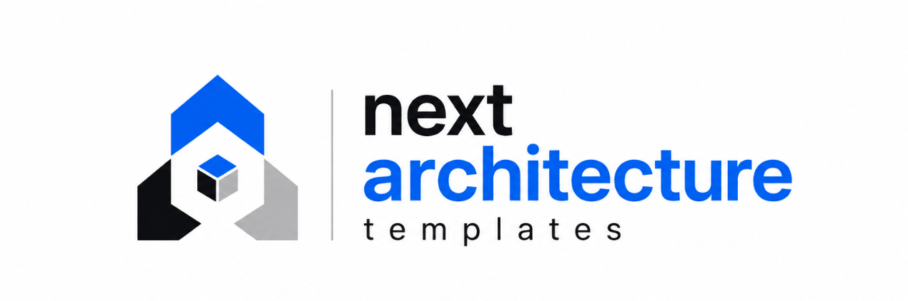

<p align="center">
  
</p>

<h1 align="center">next-architecture-templates</h1>

<p align="center">
  
  &nbsp;
  
  &nbsp;
  
  &nbsp;
  
  &nbsp;
  
</p>

<p align="center">
  Remote template repository for <a href="https://github.com/santi1475/create-next-arch"><code>create-next-arch</code></a>. Three production-ready Next.js 15 boilerplates pre-configured with distinct architectural patterns — consumed via HTTP tarball through <a href="https://github.com/unjs/giget"><code>giget</code></a>.
</p>

---

## Templates

| Template | Architecture | Best For |
|---|---|---|
| `feature` | Feature-Driven System (FDS) | Large, modular apps with clear domain boundaries |
| `layer` | Layer-Based Clean Architecture | Mid-size apps requiring technical separation |
| `ddd` | Domain-Driven Design Lite | Enterprise apps with complex business logic |

---

## Shared Stack

All three templates ship with an identical, opinionated base:

| Dependency | Purpose |
|---|---|
| **Next.js 15** (App Router) | Full-stack React framework |
| **React 19** | UI runtime |
| **TypeScript 5+** (`strict: true`) | Type safety across all layers |
| **Tailwind CSS v4** | Utility-first CSS via CSS-import config |
| **@tanstack/react-query** | Server state management |
| **next-themes** | Dark/light theme with SSR support |
| **clsx + tailwind-merge** | Conditional class merging (`cn` utility) |
| **ESLint 9** (flat config) | Static analysis with Next.js rules |
| **Prettier 3** | Opinionated formatting |
| **Commitlint** | Conventional commit enforcement |

---

## Architecture Specifications

### Feature-Driven System (`templates/feature`)

Organizes code by **domain feature** rather than technical type. Each feature is a self-contained module with its own components, hooks, services, and types, exposed through a single public API (`index.ts`).

```
src/
├── app/                        # Next.js App Router
├── features/
│   ├── auth/
│   │   ├── components/
│   │   ├── hooks/
│   │   ├── services/
│   │   ├── types/
│   │   └── index.ts            # Public API — only import from here
│   └── dashboard/
│       ├── components/
│       ├── hooks/
│       ├── services/
│       └── index.ts
└── shared/
    ├── components/ui/           # Cross-feature UI primitives
    ├── components/layout/       # Headers, footers, wrappers
    ├── hooks/                   # Cross-feature hooks
    ├── lib/http.ts              # Typed fetch client (GET/POST)
    ├── providers/               # ReactQueryProvider, ThemeProvider
    ├── types/
    └── utils/cn.ts
```

**Path aliases:** `@features/*` · `@shared/*` · `@ui/*` · `@hooks/*` · `@utils/*` · `@app-types/*`

---

### Layer-Based (`templates/layer`)

Partitions code by **technical responsibility**. Flat and predictable — ideal for teams that prioritize navigability over domain isolation.

```
src/
├── app/                        # Next.js App Router
├── components/
│   ├── ui/                     # Atomic, reusable UI elements
│   ├── layout/                 # Page structure components
│   └── forms/                  # Form-specific components
├── hooks/                      # Custom React hooks
├── services/                   # API calls and business logic
├── store/                      # Global state (Zustand / Redux)
├── types/                      # Shared TypeScript types
├── utils/cn.ts
├── constants/
├── styles/
└── providers/                  # ReactQueryProvider, ThemeProvider
```

**Path aliases:** `@components/*` · `@ui/*` · `@hooks/*` · `@services/*` · `@store/*` · `@utils/*` · `@app-types/*`

---

### Domain-Driven Design Lite (`templates/ddd`)

Enforces a strict **layered dependency rule**: `presentation` → `application` → `domain`, with `infrastructure` implementing domain contracts. No layer imports from a layer above it.

```
src/
├── app/                        # Next.js App Router
├── domain/
│   ├── user/
│   │   ├── entities/           # Core business objects
│   │   ├── repositories/       # Interface contracts (no implementation)
│   │   └── value-objects/
│   └── product/
│       ├── entities/
│       └── repositories/
├── application/
│   ├── user/use-cases/         # Orchestrates domain logic
│   └── product/use-cases/
├── infrastructure/
│   ├── api/                    # Fetch client, REST adapters
│   ├── storage/                # LocalStorage, cookies
│   └── db/                     # Local/mock DB adapters
├── presentation/
│   ├── components/             # Page layouts, sections, shared UI
│   └── hooks/                  # UI controllers binding presentation ↔ use-cases
└── shared/
    ├── providers/              # ReactQueryProvider, ThemeProvider
    ├── types/
    └── utils/cn.ts
```

**Path aliases:** `@domain/*` · `@application/*` · `@infrastructure/*` · `@presentation/*` · `@shared/*`

---

## Usage with `create-next-arch`

These templates are consumed automatically by the CLI — no manual interaction with this repository is required:

```bash
npx create-next-arch my-app --template feature
npx create-next-arch my-app --template layer
npx create-next-arch my-app --template ddd
```

### Direct download via `giget`

If you want to pull a template without the CLI:

```bash
npx giget gh:santi1475/next-architecture-templates/templates/feature my-app
npx giget gh:santi1475/next-architecture-templates/templates/layer my-app
npx giget gh:santi1475/next-architecture-templates/templates/ddd my-app
```

---

## Repository Structure

```
/
├── assets/                     # Repository assets (logo, screenshots)
├── templates/
│   ├── feature/                # Feature-Driven System boilerplate
│   ├── layer/                  # Layer-Based boilerplate
│   └── ddd/                    # DDD Lite boilerplate
└── README.md
```

Each subdirectory under `templates/` is a standalone Next.js 15 project. No `node_modules` or `.git` are included — dependencies are installed by the consumer CLI after download.

---

## Design Decisions

**`@app-types/*` instead of `@types/*`**
The `@types/*` namespace is reserved by TypeScript for `DefinitelyTyped` packages (`@types/node`, `@types/react`). Using it as a path alias causes subtle module resolution conflicts. All templates use `@app-types/*` as the safe alternative.

**Tailwind CSS v4 — no `tailwind.config.ts`**
Tailwind v4 ships configuration via CSS directives (`@import "tailwindcss"`). A `tailwind.config.ts` file is intentionally omitted — customization is done directly in `globals.css` using `@theme` blocks.

**Providers outside `app/`**
`ReactQueryProvider` and `ThemeProvider` are placed in a `providers/` directory (not inside `app/`) to keep the App Router directory clean and allow providers to be imported via path aliases.

---

## Contributing

Pull requests are welcome. To add a new template or modify an existing one, open an issue first to align on the architectural rationale. Changes to shared tooling (ESLint, Prettier, commitlint) should be applied across all three templates simultaneously.

---

## License

[MIT](LICENSE.md)
